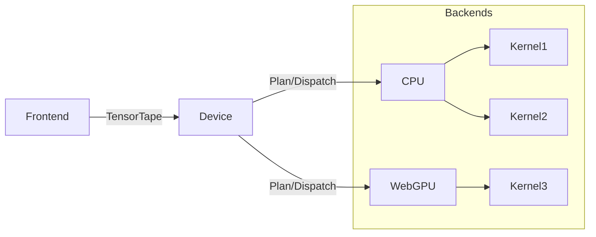

# Mia

[](https://deepwiki.com/cryscan/mia)

*A Lightweight, Cross-Platform Inference Framework in Rust*

🚧 **Note: Mia is under active development. Core functionality is being implemented and APIs may change.**

---

`mia` is a high-performance model inference framework designed for efficient execution of machine learning models across diverse hardware platforms. Built in Rust, it emphasizes type safety, memory efficiency, and cross-platform compatibility, supporting both native applications and web browsers via WebGPU.

## 🚧 Design Philosophy

Mia solves model deployment challenges through a dual-component architecture:

### 1. Typed Frontend API
The frontend leverages Rust's type system to enforce correctness at compile-time. Developers define computation graphs through declarative operations:

```rust
#[tokio::test]
async fn test_add_f32x4() -> Result<(), Box<dyn Error>> {
    let cpu = CpuBuilder::new().add_default_ops().build().await;
    const C: usize = 1024;
    const T: usize = 768;

    let data: Arc<[f32]> = (0..C * T).map(|x| x as f32).collect();
    let reference: Box<[f32]> = data.iter().map(|x| x + x + x + x).collect();

    // create tensors with compile-time type enforcement
    let a = Tensor::create(cpu.clone(), [C, T], data.clone())?.cast::<F32x4>([C / 4, T])?;
    let b = Tensor::create(cpu.clone(), [C, T], data.clone())?.cast::<F32x4>([C / 4, T])?;
    
    // build computation graph through operator overloading
    let b = a.clone() + b;
    let d = a + b.clone() + c;

    // execution triggered explicitly
    let output = d.cast::<f32>([C, T])?.back().await?;
    assert_eq!(output, reference);

    // only this addition will be executed here (no redundant computations)
    let d = b.clone() + b;

    let output = d.cast::<f32>([C, T])?.back().await?;
    assert_eq!(output, reference);

    Ok(())
}
```

Key characteristics:
- **Type-Safe Operations**: Compiler rejects invalid operations (e.g., `f32` + `i32`)
- **Shape Awareness**: Runtime layout validation for operation compatibility
- **Zero-Cost Abstraction**: Operations build computation graphs without immediate execution

### 2. Lazy Evaluation with Tensor Tape
Computation is deferred until explicit `.back().await` call, enabled by the `Tensor` structure:

```rust
pub struct Tensor<D, T> {
    /// Hardware backend.
    device: D,
    /// CuTe style layout algebra.
    layout: Layout,
    /// Unique resource identifier.
    id: TensorId,
    /// Shared operation recorder.
    tape: Arc<TensorTape>,
    /// Type marker.
    phantom: PhantomData<T>, 
}
```

The `tape` serves as:
- **Operation Recorder**: Tracks all tensor transformations
- **Memory Management Hub**: Reference-counted via `Arc` for automatic lifetime tracking
- **Serialization Unit**: Encodes computation graphs for persistence/transfer
- **Execution Trigger**: Converts to execution plan on `.back().await`

### 3. Ownership-Driven Memory Reuse
Mia exploits Rust's ownership semantics:
- Tensor operations consume inputs (`a + b` transfers ownership)
- Backend inspects `tape` reference counts pre-execution
- Zero-copy buffer reuse when reference counts allow
- Eliminates need for manual memory management or GC

### 4. Decoupled Backend Architecture


- Operations defined as device-agnostic `TensorOp` traits
- Platform-specific implementations (CPU/WebGPU)
- Uniform execution interface across targets

## Getting Started

```toml
[dependencies]
mia = { git = "https://github.com/cryscan/mia" }
```

```rust
//! Example: CPU-based vector addition
```

## Supported Operations
| Category    | Ops                        | CPU | WebGPU |
| ----------- | -------------------------- | --- | ------ |
| Arithmetic  | `add`, `mul`, `matmul`     | ✅   | ⏳      |
| Tensor      | `reshape`, `slice`, `cast` | ✅   | ✅      |
| Activations | `relu`, `gelu`, `softmax`  | ⏳   | ⏳      |

✅ = Implemented  
⏳ = In Progress
